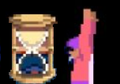

# Jaffar 



High-performance solver for Prince of Persia (DOS) tool-assisted speedrunning.  

Docker
===============

To get a ready-to-run Docker container with Jaffar, simply run:

```
docker run sergiom86/jaffar:latest
```

Installation
===============

Follow these steps to manually install in your system

1) Get code

 
```
  git clone --recursive https://github.com/SergioMartin86/jaffar.git
```
  
2) Create build directory


```
  cd jaffar
  mkdir build
  cd build
```

3) Configure and compile

```
  meson ..
  ninja
```
  
Requisites
============

- Meson - For compilation
- Ninja - For compilation
- SDL2: Jaffar has been tested using SDL2 2.0.14. 
- SDL2-image: Jaffar has been tested using SDL2_image 2.0.5.

Usage
=========


```
jaffar-train example.sav example.jaffar
```

Where example.sav is a SDLPop-compatible savestate, and example.jaffar is a Jaffar script with rules to solve the level.

NOTE: If you see the following message:

```
[ERROR] Wrong size of input state lvl06b.sav. Expected: 2714, Read: 2710 bytes.
```

This means you have produced the .sav file with an older version of SDLPop. Yo solve this, add additional zeros at the end of the savestate, until it meets the required size.

For tools to display the current state of training and/or the final results, see: `https://github.com/SergioMartin86/jaffar-play`


Tunable Compilation-Time Parameters:
--------------------------------------

The file `source/frame.h` contains a few tunable parameters that allows for smaller state sizes to save memory and run with much larger frame databases:

- `_MAX_FRAME_DIFF`: Defines the maximum number of byte differences between the frames in the database and the original savestate. Each reduction in this number will save 3 bytes per Frame. If training exceeds the number of differences, Jaffar will print an error. In that case, the user must increase this value and recompile Jaffar.

- `_MAX_RULE_COUNT`: Defines the maximum number of rules in a Jaffar script. Every reduction in this number will save one byte per Frame. If the number of rules in the Jaffar script exceeds this number, Jaffar will print an error. In that case, the user must increase this value and recompile Jaffar.

- `_MAX_MOVELIST_SIZE`: Defines the maximum number of moves to include in a solution. Frames will contain one less byte for every 2 moves reduced. If the number of moves in the Jaffar excecution exceeds this number, Jaffar will end without producing a solution. In that case, the user must increase this value and recompile Jaffar.

Environment Variables:
------------------------

Indicate where the SDLpop root folder is located:

```
export SDLPOP_ROOT=$HOME/jaffar/extern/SDLPoP
```

Indicate number of OMP threads to use. Leave empty if unsure of how many to use.

```
export OMP_NUM_THREADS=16
```

Specify maximum memory size to be used for frame database per worker (in megabytes): 

```
export JAFFAR_MAX_FRAME_DATABASE_SIZE_MB=1000
```

Specify maximum hash table history (last N game frames during which Jaffar will check for duplicates):

```
export JAFFAR_HASH_AGE_THRESHOLD=100
```

Specify how frequently (in seconds) and where the `jaffar-train` command should save the best state of exploration:

```
export JAFFAR_SAVE_BEST_EVERY_SECONDS=5
export JAFFAR_SAVE_BEST_PATH=jaffar.best.sav
```

Specify how frequently (in seconds) and where the `jaffar-train` command should save the current state of exploration:

```
export JAFFAR_SAVE_CURRENT_EVERY_SECONDS=1
export JAFFAR_SAVE_CURRENT_PATH=jaffar.current.sav
```

Indicates whether to produce a move list for a solution. If TRUE, frame states will not store or show the move list and will occupy many fewer bytes in memory. You need to recompile Jaffar for this to take effect.

```
export JAFFAR_DISABLE_MOVE_HISTORY=TRUE
```

Authors
=============

- Sergio Martin (eien86)
  + Github: https://github.com/SergioMartin86
  + Twitch: https://www.twitch.tv/eien86
  + Youtube: https://www.youtube.com/channel/UCSXpK3d6vUq58fjgF5jFoKA
   
Credits to Alexander Lyashuk (mooskagh, crem) for the initial idea and development of an initial version of the bot (https://bitbucket.org/mooskagh/sdlpop-tricks).
Credits to David Nagy and the developers of SDLPop (https://github.com/NagyD/SDLPoP) for reverse engineering Prince of Persia and making this possible.
